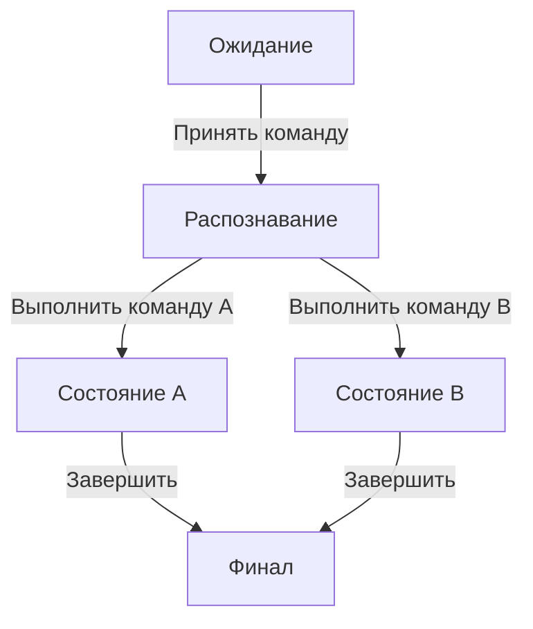
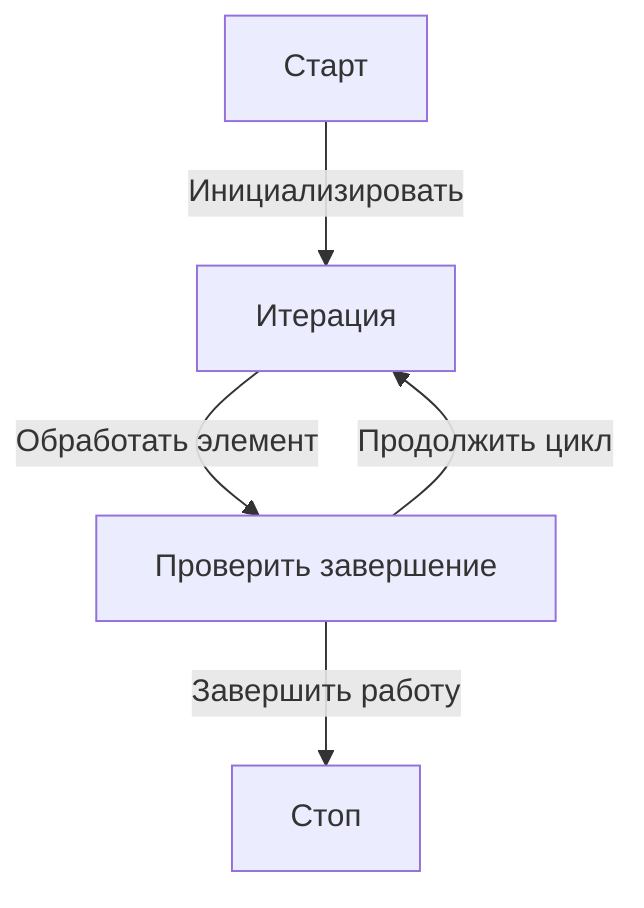

**программные системы можно свести к комбинациям простейших элементов** — как в геометрии (симплексы) и в теории графов («кружки» и «стрелки»). Давай разберём, как это помогает в проектировании программ.

---

### 1. **Графическая конструкция: «Кружки» и «Стрелки»**
Это **ориентированный граф**, где:
- **Кружки (вершины)** — действия, состояния или данные.
- **Стрелки (рёбра)** — переходы, зависимости или потоки управления.

**Как это связано с симплексами?**  
[Симплекс](./Simpex_Designed_For.md)ы — это минимальные *полносвязные* структуры в своём измерении. В программировании это можно интерпретировать так:
- **0D (точка)** — отдельная операция (`print("Hello")`).
- **1D (отрезок)** — последовательность двух операций (`A → B`).
- **2D (треугольник)** — ветвление (`if-else` образует 3 связи: условие → `A`, условие → `B`, `A/B` → следующая операция).
- **3D (тетраэдр)** — сложный контроль потока (например, `switch` с несколькими случаями + цикл).

Чем выше «размерность» графа программы, тем сложнее зависимости, но **всё можно разложить на примитивы**.

---

### 2. **Три базовые структуры: 

Вы абсолютно правы — **"Условие верно"** это предикат, а в управляющем автомате на переходах должны быть только **действия-глаголы**. Исправляюсь окончательно:

---

### **Идеально строгие управляющие автоматы**

#### 1. **Switch (ветвление)**
**Mermaid** (только действия):


**DSL** (корректный):
```dsl
state "Ожидание" {
    transition "Принять команду" -> "Распознавание"
}

state "Распознавание" {
    transition "Выполнить команду A" -> "Состояние A"
    transition "Выполнить команду B" -> "Состояние B"
}

state "Обработка A" {
    transition "Завершить" -> "Финал"
}

state "Обработка B" {
    transition "Завершить" -> "Финал"
}
```

---

#### 2. **Цикл** (вместо if - состояния)
**Mermaid**:


**DSL**:
```dsl
state "Старт" {
    transition "Инициализировать" -> "Итерация"
}

state "Итерация" {
    transition "Обработать элемент" -> "Проверить завершение"
}

state "Проверить завершение" {
    transition "Продолжить цикл" -> "Итерация"
    transition "Завершить работу" -> "Стоп"
}
```

---

### 🔥 **На подкорку:**
1. **На переходах ТОЛЬКО глаголы:**  
   - ❌ Не: `"Условие верно"`, `"Если ошибка"`  
   - ✅ Да: `"Повторить проверку"`, `"Зарегистрировать ошибку"`  

2. **Состояния — не глаголы:**  
   - ❌ Не: `"Ожидание ввода"`, `"Режим обработки"`
   - ✅ Да: `"Проверка"`, `"Ошибка"`    

3. **Логика внутри состояний:**  
   Решение о переходе принимается **внутри состояния** (например, вызов метода `shouldContinue()`), но на диаграмме показывается как отдельное действие.

---

### ✅ **Итог:**
- **Никаких "если" на переходах** — только явные действия.  
- **Никаких вопросов в состояниях** — только факты.  
- **Цикл = действие "Продолжить"** с возвратом.  

соответствует теории управляющих автоматов. 