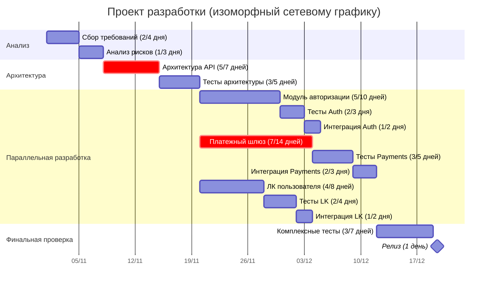

По мотивам
Кузнецов П.Г. *«Наука развития Жизни»* (Том III). — М.: Русское Космическое Общество, 2015.

Сложная программа - которая не умещается в памяти разработчика.
Для одного программа сложная, для другого нет.

План создания программы: 
- список работ
- список связей между работами

Выражение плана работ, отражающего как параллельность работ, так и их следование друг за
другом, возможно лишь графически на плоскости.

Простейший способ такого выражения предложен Гантом - способ ленточных диаграмм.

Диаграмма Ганта становится трудно обозримой для списка работ в несколько сотен.

Она неэффективно использует плоскость.
Если каждой ленточке приписать номер работы, то
вертикальный масштаб может быть существенно уменьшен: это преобразование переводит каждую ленточку в стрелку.

### **Диаграмма Ганта с параллельными задачами и изоморфный сетевой график**

#### 1. Диаграмма Ганта с параллельным выполнением

Для отображения модели машинной программы - после каждого действия требуется добавить проверку и действие в случае ошибки.

#### 2. Изоморфный сетевой график
TODO: