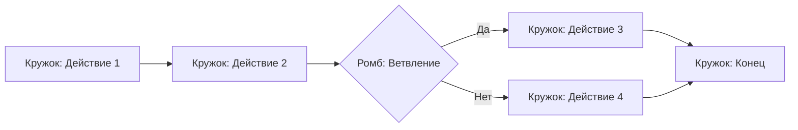
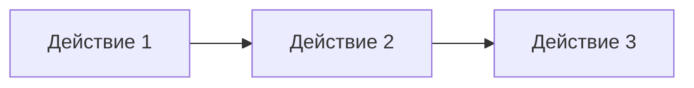
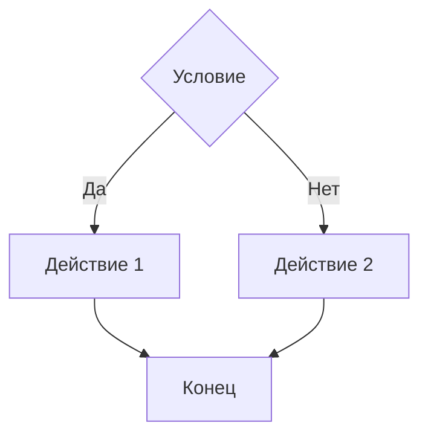
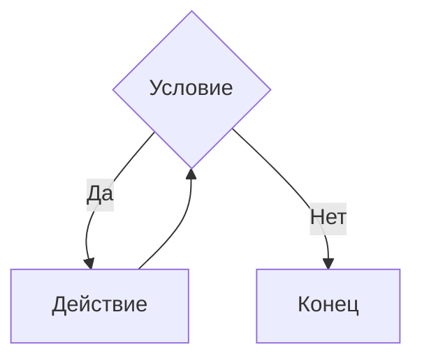
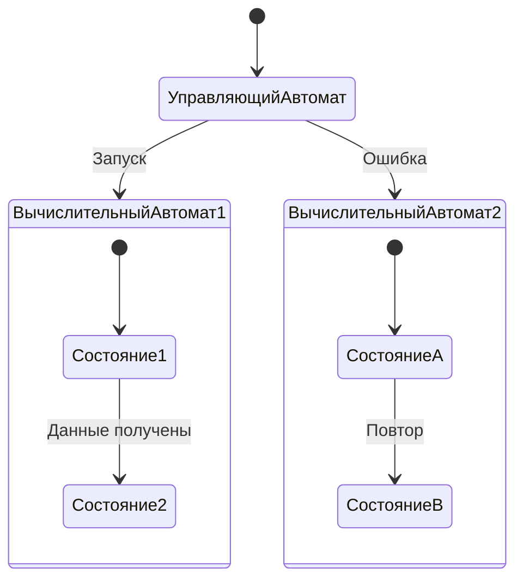

### **1. Графическая конструкция («Кружки и стрелки»)**

**Пояснение**:  
- **Кружки** — атомарные операции (SRP).  
- **Стрелки** — поток управления.  
- **Ромб** — точка ветвления (2D-симплекс).  

---

### **2. Три базовые структуры**
#### **a) Последовательность (1D)**

#### **b) Ветвление (2D)**

#### **c) Цикл (3D)**

---

### **3. Автоматы Шалыто**
#### **Управляющий автомат + Вычислительные автоматы**

**Пояснение**:  
- **Управляющий автомат** — координирует переходы между вычислительными автоматами (аналог «стрелок» между «кружками»).  
- **Вычислительные автоматы** — реализуют конкретные операции (аналог SRP-методов).  

**Ключевые связи**:  
1. **Графы Кузнецова** → Визуализация «кружков и стрелок».  
2. **DRAKON** → Стандартизация структур (последовательность/ветвление/цикл).  
3. **Автоматы Шалыто** → Чёткое разделение на управление и вычисления.  

**Что даёт пользователю**:  
- **Гибкость**: графы, которые автоматически превращаются в код.  
- **Понятность**: Видит программу как устройство из автоматов.  
- **Контроль сложности**: Свёртывание блоков по аналогии с симплексами.  
