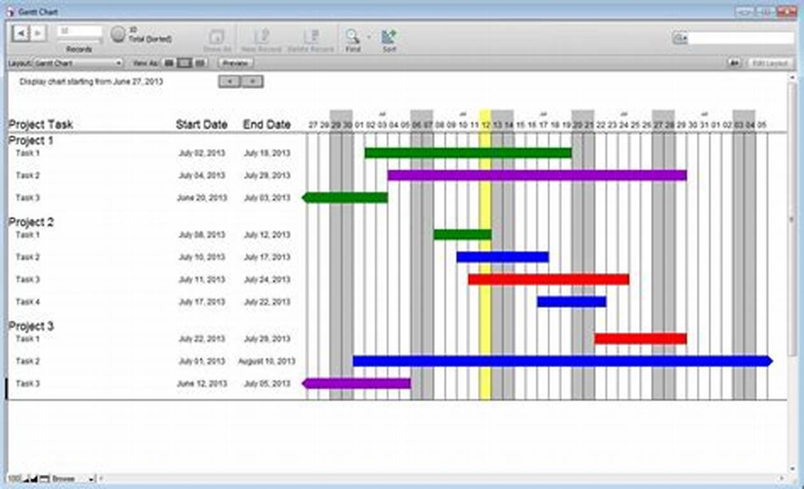
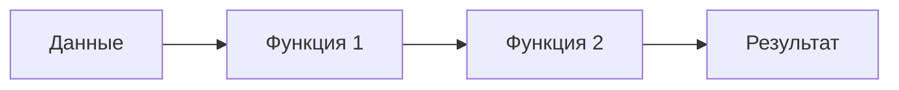
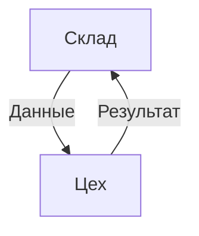
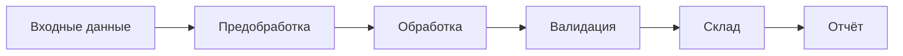
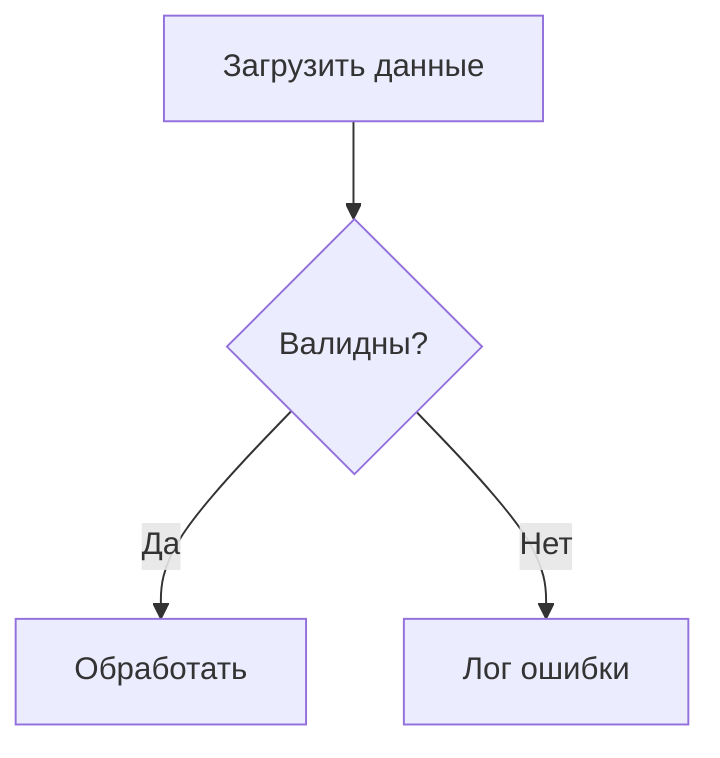
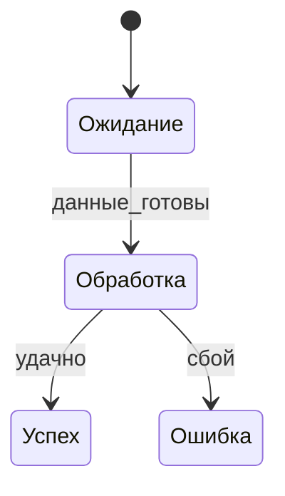

### **Конспект: Единая теория программирования на основе математики**
*(Чистые функциональные конвейеры данных + модель "Склад/Цех")*  
**Автор**: Линь Пенчэн (Lin Pengcheng)  


---

## **1. Основные принципы**  
### **1.1. Чистые функциональные конвейеры данных**  
**Суть**:  
Программа — это **поток данных**, проходящий через цепочку **чистых функций** (без побочных эффектов).  

**Диаграмма**:  

**Ключевые свойства**:  
- **Детерминированность**: Одинаковые входы → одинаковые выходы.  
- **Неизменяемость**: Данные не меняются, создаются новые.  
- **Композируемость**: Функции легко комбинируются.  

---

### **1.2. Модель "Склад/Цех"**  
**Аналогия**:  
- **Склад (Warehouse)**: Хранение данных (базы данных, кэш).  
- **Цех (Workshop)**: Обработка данных (чистые функции).  

**Диаграмма**:  

**Правила**:  
1. Цех **не изменяет** данные на Складе.  
2. Все операции — **явные преобразования** (новые версии данных).  

---

## **2. Математическая основа**  
### **2.1. Теория категорий**  
- **Функции** — морфизмы.  
- **Данные** — объекты.  
- **Композиция** — цепочка морфизмов.  

**Пример**:  
```haskell
-- Чистая функция в Haskell
transform :: Data -> Result
transform = step2 . step1  -- Композиция
```

### **2.2. Логика управления**  
- **Управление потоком** — через **конвейеры** (а не циклы/ветвления).  
- **Ошибки** — обрабатываются как данные (например, `Either` в Haskell).  

---

## **3. Практическое применение**  
### **3.1. Архитектура системы**  

**Этапы**:  
1. **Предобработка**: Фильтрация, нормализация.  
2. **Обработка**: Преобразования (например, ML-модели).  
3. **Валидация**: Проверка качества.  

### **3.2. Преимущества**  
- **Масштабируемость**: Параллельное выполнение этапов.  
- **Надёжность**: Нет скрытых состояний.  
- **Тестируемость**: Каждая функция проверяется изолированно.  

---

## **4. Интеграция с DRAKON и автоматами Шалыто**  
### **4.1. Визуализация конвейеров (DRAKON)**  


### **4.2. Управление состояниями (Шалыто)**  


---

## **5. Выводы**  
1. **Универсальность**: Подход применим к любым доменам (от ETL до IoT).  
2. **Математическая строгость**: Основан на категориях и алгебре.  
3. **Гибкость**: Комбинируется с другими парадигмами (ООП, автоматы).  

