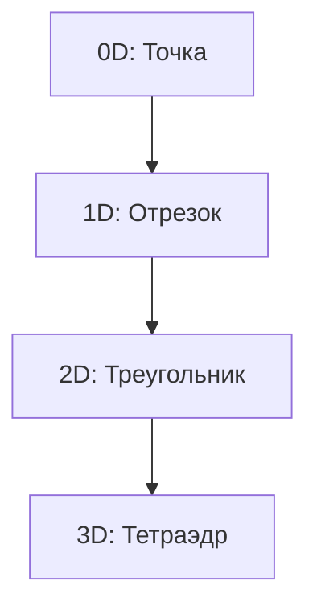

конструктор, но вместо кубиков лишь особые детали — **симплексы**.

---

## 🧩 **Что такое симплекс?** (на пальцах)  
Это **самая простая фигура** в своём измерении:  
- **0D** (точка) — 1 вершина  
- **1D** (палочка) — 2 вершины → отрезок  
- **2D** (треугольник) — 3 вершины  
- **3D** (пирамидка-тетраэдр) — 4 вершины  
- и так далее...  



**Формула** — это просто правило, как смешивать вершины:  
```python
точка_в_симплексе = λ₀*v₀ + λ₁*v₁ + ... + λₙ*vₙ
# где λ₀ + λ₁ + ... + λₙ = 1 и все λ ≥ 0
```
(По сути, `lerp`, но для многих точек.)

---

## ❓ **Зачем это придумали?**  
1️⃣ **Чтобы разбивать сложное на простое**  
Любую фигуру можно собрать из симплексов (как из треугольников собирают 3D-модели).  

2️⃣ **Чтобы искать минимумы/максимумы**  
В оптимизации есть **симплекс-метод** — алгоритм для решения задач типа *"как сделать дешевле/быстрее"*.  

3️⃣ **Чтобы анализировать данные**  
В машинном обучении и топологии симплексы помогают находить *"дыры"* и *"формы"* в данных.  

---

## 🔧 **Где это используют?**  
- **Компьютерная графика** → меши из треугольников (2D симплексы)  
- **Игровые движки** → коллайдеры из тетраэдров (3D симплексы)  
- **Научные расчёты** → разбиение пространства на простые элементы  
- **Экономика/логистика** → симплекс-метод для оптимизации  

---

## 📚 **Что нужно понимать заранее?**  
Минимум:  
- **Векторы** (что такое точка в n-мерном пространстве)  
- **Линейная независимость** (чтобы точки не лежали на одной прямой/плоскости)  
- **Выпуклые оболочки** ("мешок", натянутый на точки)  

---

## 🎯 **Вывод**  
Симплекс — это **"кирпичик"** для построения сложных форм. Его придумали, чтобы:  
- Упрощать расчёты  
- Разбивать пространство на части  
- Оптимизировать что угодно (от рендера графики до доставки пиццы)  

**Пример из жизни:**  
Твой процессор прямо сейчас использует **треугольники (2D симплексы)** для рендера этой страницы!  

Теперь понятнее? 😊