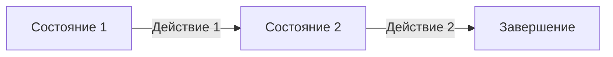
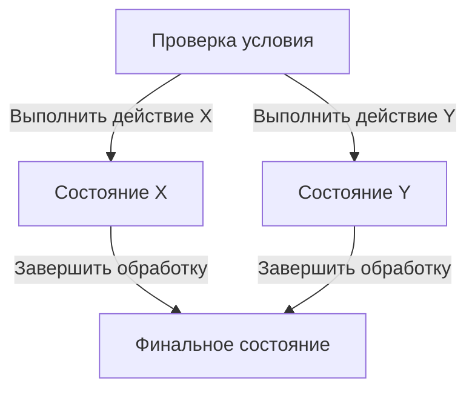
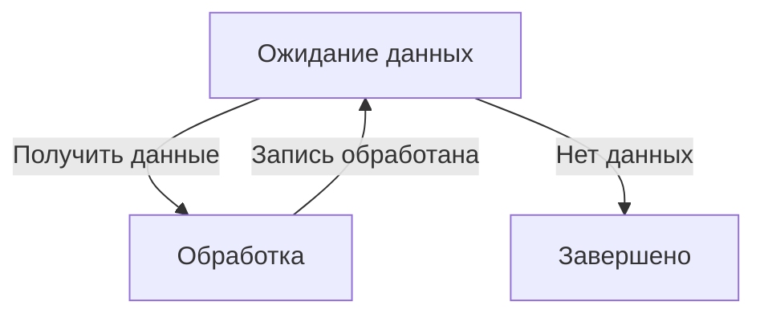

# 🚀 **Фундаментальный подход к визуальному программированию: состояния и действия**

> **Цель:** Построение универсального визуального редактора на основе **машин состояний (FSM)** с генерацией кода.

---

## 🔥 **Ключевой вывод:**
> **Да!** Ветвления и циклы можно выразить **только прямоугольниками (состояниями) и стрелками (переходами)**.  
> Это основа **конечных автоматов (FSM)**, способных описать **любую программу**.

---

## 🧩 **3 базовые структуры программирования в визуальном виде**

### 1. 📜 **Последовательность** (линейный поток)


---

### 2. 🌳 **Ветвление** (if/else)


---

### 3. 🔄 **Цикл** (while/for)


---

## 🛠 **Примеры кода DSL (Domain-Specific Language)**

### 🌿 **Ветвление:**

### 🔁 **SWITCH:**
```dsl
state "Проверка статуса" @(100, 100) {
    transition "[статус = успех]" -> "Обработка успеха"
    transition "[статус = ошибка]" -> "Обработка ошибки"
    transition "[статус неизвестен]" -> "Завершение"
}

state "Обработка успеха" @(300, 50) {
    transition "Сохранить результат" -> "Завершение"
}

state "Обработка ошибки" @(300, 150) {
    transition "Повторить попытку" -> "Проверка статуса"
    transition "Отменить операцию" -> "Завершение"
}

state "Завершение" @(500, 100)
```
### 🔁 **Цикл:**
---

## 📊 **Сводная таблица возможностей**

| Структура       | Реализуемость | Как?                          |
|-----------------|---------------|-------------------------------|
| **Последовательность** | ✅ Да | Линейные переходы между состояниями |
| **Ветвление**          | ✅ Да | Условие → несколько веток → слияние |
| **Цикл**               | ✅ Да | Обратная стрелка к условию |

---

## 🧠 **Почему это работает?**
- **Конечные автоматы (FSM)** — полны по Тьюрингу (могут описать любую логику).
- **Графовая модель** — интуитивно понятна и визуализируема.
- **Генерация кода** — автомат легко преобразуется в императивный код.

---

## 📚 **Источники вдохновения**
- **Сетевые графики**
Побиск Кузнецов 
- **Метод SWITCH-программирования** (Шалыто)  
  → Явные состояния + управляющие переходы.
- **Визуальные языки** (ДРАКОН)  
  → Эргономикаа понимания схем.

---

## 🎯 **Заключение**
> **Любая программа** может быть представлена как **граф состояний и переходов** → **визуализирована** → **преобразована в код**.  
---

💡 **TODO:**  
- Добавить разворачивание, сворачивание **вложенныж состояний** (иерархия).  
- Реализовать **генератор кода** (Python/JS/C++).  
- Оптимизировать **визуальное представление** (группировка, цвета).  

🚀 **Вперёд, к созданию идеального визуального программирования!**