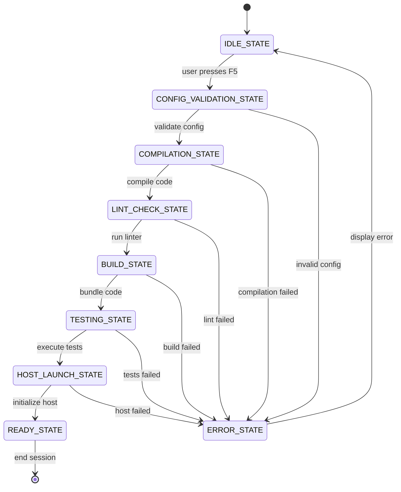

Машина состояний VS Code приз нажатии F5 на файле extension.ts

```mermaid
stateDiagram-v2
    [*] --> IDLE_STATE
    IDLE_STATE --> CONFIG_VALIDATION_STATE: user presses F5
    
    CONFIG_VALIDATION_STATE --> COMPILATION_STATE: validate config
    CONFIG_VALIDATION_STATE --> ERROR_STATE      : invalid config
    
    COMPILATION_STATE --> LINT_CHECK_STATE: compile code
    COMPILATION_STATE --> ERROR_STATE     : compilation failed
    
    LINT_CHECK_STATE --> BUILD_STATE: run linter
    LINT_CHECK_STATE --> ERROR_STATE: lint failed
    
    BUILD_STATE --> TESTING_STATE: bundle code
    BUILD_STATE --> ERROR_STATE  : build failed
    
    TESTING_STATE --> HOST_LAUNCH_STATE: execute tests
    TESTING_STATE --> ERROR_STATE      : tests failed
    
    HOST_LAUNCH_STATE --> READY_STATE: initialize host
    HOST_LAUNCH_STATE --> ERROR_STATE: host failed
    
    ERROR_STATE --> IDLE_STATE: display error
    READY_STATE --> [*]       : end session
```