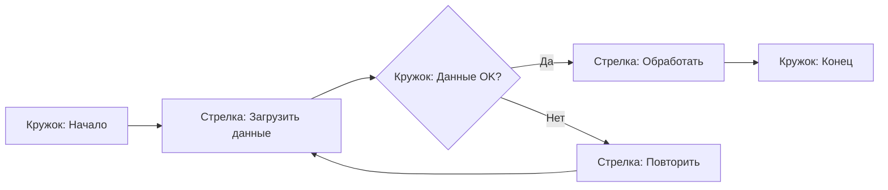

### **1. Три кита программирования и «кружки со стрелками»**  
Оба подхода говорят об одном: **любую сложную систему можно разложить на простые, универсальные элементы**.  

- **В программировании** это:  
  - **Последовательность** (делай шаг за шагом).  
  - **Ветвление** (если «А» — иди направо, иначе — налево).  
  - **Цикл** (повторяй, пока не получится).  

- **В сетевых моделях** у Кузнецова:  
  - **Кружок** (состояние) = точка принятия решений (как `if` или начало/конец цикла).  
  - **Стрелка** (процесс) = последовательность действий или переход между состояниями.  

Пример: 

Это и есть **программа** (цикл + ветвление), и **сетевая модель** (кружки + стрелки) одновременно!

---

### **2. Почему это универсально?**  
- **Программирование:** Компьютер понимает только «да/нет» и «повтори». Всё остальное — их комбинации.  
- **Сети Кузнецова:** Любой процесс в реальном мире — это череда **событий** (кружков) и **действий** (стрелок).  

Аналогия из жизни:  
- **Приготовление чая** = программа + сеть:  
  - **Кружки:** «Чайник пуст», «Вода кипит», «Чай готов».  
  - **Стрелки:** «Наполнить чайник», «Ждать 5 мин», «Залить чай».  
  - **Ветвление:** Если нет чая → пойти в магазин (цикл).  

---

### **3. Философский смысл**  
Оба подхода показывают:  
- **Сложное = простое + правила комбинации.**  
- Математика и программирование — не про «цифры», а про **умение раскладывать хаос на четкие элементы**.  

Как писал Кузнецов:  
> *«Любая содержательная программа может быть представлена в форме сетевой модели»*.  

То есть:  
- Программист думает «ветвлениями и циклами».  
- Инженер или учёный думает «кружками и стрелками».  
- **Но суть одна — структурирование реальности.**  

---

### **4. Что это даёт гуманитарию?**  
- **Метод анализа:** Разбивать любую задачу (даже написание стихов!) на:  
  - **Состояния** (например, «идея → черновик → редактура»).  
  - **Переходы** («если рифма не работает → переписать»).  
- **Язык для дискуссий** с технарями: «Давайте нарисуем схему вашего процесса как кружки и стрелки».  

---

### **Итог**  
Связь между этими идеями — как между **алфавитом и словарём**:  
- 3 структуры программирования = **буквы**.  
- Кружки и стрелки = **слова**.  
- А вы уже составляете из них **«тексты»** (программы, планы или даже стихи).  

Это и есть магия системного мышления!