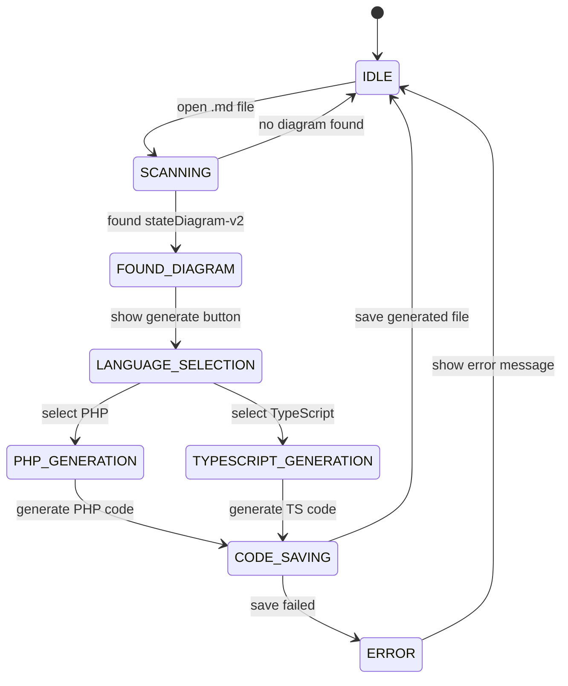

```mermaid
stateDiagram-v2
    [*] --> IDLE
    IDLE --> SCANNING: open .md file
    
    SCANNING --> FOUND_DIAGRAM: found stateDiagram-v2
    SCANNING --> IDLE: no diagram found
    
    FOUND_DIAGRAM --> LANGUAGE_SELECTION: show generate button
    
    LANGUAGE_SELECTION --> PHP_GENERATION: select PHP
    LANGUAGE_SELECTION --> TYPESCRIPT_GENERATION: select TypeScript
    
    PHP_GENERATION --> CODE_SAVING: generate PHP code
    TYPESCRIPT_GENERATION --> CODE_SAVING: generate TS code
    
    CODE_SAVING --> IDLE: save generated file
    CODE_SAVING --> ERROR: save failed
    
    ERROR --> IDLE: show error message
```