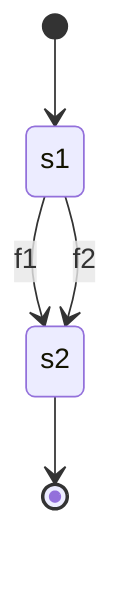

Расширение VS Code "Lord Rich Mole" должно уметь работать с кодом mermaid конечных автоматов и генерировать код из них.
Генерацию кода начнём с PHP. Потом сделаем генерацию кода для любого языка программирования.

Расширение запускается на файле с расширением .md.
Находит в нём код mermaid stateDiagram-v2 и показывает свою кнопку генерации кода.

(Что такого вставить в код mermaid, чтобы обозначить на каком языке генерировать код?).

Если расширение на находит признак кода в диаграмме, то показывает кнопку выбора языка и кноку отмены.

При выборе языка, расширение генерирует код по диаграмме mermaid в выбранном языке - организуя параллельное выполнение кода в программе. 

Расширение считает, что в прямоугольниках - состояния, в стрелках - функции.

Пример диаграммы с параллельным выполнением функций:

в прямоугольниках - состояния, в стрелках - функции.

TypeScript функция codeGeneration_PHP(s) из строки кода mermaid будет генерировать код PHP:
```php
<?php

// Состояния автомата
define('STATE_S1', 's1');
define('STATE_S2', 's2');

// Текущее состояние
$currentState = STATE_S1;

// Код функций генерировать не нужно

// Обработка перехода между состояниями
function handleTransition(&$state, $event) {
    switch ($state) {
        case STATE_S1:
            if ($event === 'f1') {
                f1();
                return STATE_S2;
            }
            if ($event === 'f2') {
                f2();
                return STATE_S2;
            }
            break;
            
        case STATE_S2:
            // Конечное состояние
            break;
    }
    return $state;
}

// Параллельный запуск (эмуляция через fork)
if (function_exists('pcntl_fork')) {
    $pid1 = pcntl_fork();
    if ($pid1 == 0) {
        // Дочерний процесс 1 - f1
        $currentState = handleTransition($currentState, 'f1');
        exit;
    }

    $pid2 = pcntl_fork();
    if ($pid2 == 0) {
        // Дочерний процесс 2 - f2
        $currentState = handleTransition($currentState, 'f2');
        exit;
    }

    // Ждем завершения дочерних процессов
    pcntl_waitpid($pid1, $status1);
    pcntl_waitpid($pid2, $status2);
} else {
    // Если fork не доступен - последовательное выполнение
    $currentState = handleTransition($currentState, 'f1');
    $currentState = handleTransition($currentState, 'f2');
}

echo "Final state: $currentState\n";
```

```
И сохранить его в файл с таким же именем, но с расширением .php.
